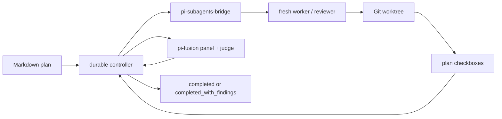

# pi-plan-exec

<!-- markdownlint-disable MD013 -->

[](https://www.npmjs.com/package/@alexeiled/pi-plan-exec)
[](https://github.com/alexei-led/pi-plan-exec/actions/workflows/ci.yml?query=branch%3Amain)
[](https://github.com/alexei-led/pi-plan-exec/actions/workflows/release.yml)
[](https://nodejs.org/)
[](https://github.com/alexei-led/pi-plan-exec/blob/main/LICENSE)

**Turn a Markdown execution plan into an isolated, resumable Pi run.**

`pi-plan-exec` solves the control problem of long-running AI implementation.
A capable agent can lose context, repeat work, skip verification, or start a
second writer after a restart. This extension moves task order, retry limits,
worktree checks, and recovery out of prompt prose into durable controller state.
It has been exercised in runs lasting a few hours; the controller keeps polling
instead of asking one chat prompt to remember the whole job.

It executes one checked-list task at a time in a Git checkout you choose, then
runs review and fix stages with fresh Pi subagents and Fusion. A worker saying
“done” is not enough: the plan’s checked items are the implementation record.

> Experimental. Start with disposable repositories or reviewable worktrees.

## What it does

- **Keeps one writer in one checkout.** `/exec` always asks whether to use an
  isolated Git worktree or work in place. Isolated runs move the interactive Pi
  session into that worktree, so its tools and footer use the execution branch.
- **Executes plans deterministically.** It selects the first incomplete task,
  starts a fresh worker, and verifies completion from the plan checkboxes.
- **Recovers deliberately.** A reload reattaches a matching run owned by the
  returning session. `/exec adopt` takes over a stale cross-session run.
  Compare-and-set records, operation IDs, controller locks, and leases avoid
  intentionally starting another writer or losing a pause or cancellation.
- **Reviews before it finishes.** It runs comprehensive, smells, Fusion, and
  critical review/fix phases. Unresolved findings remain visible in the final
  `completed_with_findings` state.

## Install and run

Install the prerequisites, then plan-exec:

```bash
pi install npm:pi-subagents
pi install npm:@tintinweb/pi-tasks
pi install npm:@alexeiled/pi-subagents-bridge@^0.2.0
pi install npm:@alexeiled/pi-fusion
pi install npm:@alexeiled/pi-plan-exec
```

The providers remain independent Pi packages. `pi-plan-exec` requires Bridge
`0.2.0` or later for safe operation lookup, probes Bridge and Fusion capabilities
before it creates a run, and tells you how to recover if they are unavailable.

Reload Pi. From an interactive session in a Git repository, run an executable
plan:

```text
/reload
/exec help
/exec docs/plans/20260713-add-greeting.md
```

While it runs, Pi shows the execution-worktree path, branch, stage, and worker.
`/exec status` only observes the run; it does not interrupt or restart it. It
also reports the recovery classification and one safe next action: wait for a
healthy operation, reconcile a preserved operation, retry a failed stage, adopt
a stale owner, or review a plan/branch mismatch. Use it without a run ID for the
current repository, and use `/exec runs` when several runs need disambiguation.
`/exec pause` stops after the active child; `/exec resume` continues paused work
or recovers a recorded failure in the same stage and preserved worktree. A
retry-exhausted or externally blocked implementation task is never retried
implicitly; fix the blocker, then use `/exec resume <run-id> --retry-task`.
Implementation checkboxes remain sequential and cannot be force-skipped. When a
provider operation may still exist, plan-exec keeps its identity and adopts it
before any retry. If a review, finalization, or
statistics stage cannot recover, `/exec skip <full-run-id> --reason <text>`
stops the tracked child before recording an explicit waiver and advancing. It
never skips implementation or archival, and the run finishes as
`completed_with_findings`. If external work moved the execution tree to another
branch, `/exec resume <full-run-id> --adopt-current-branch` provides an
interactive, audited rebind after verifying the same repository and no active
child. The installed `exec-plan` skill is also available as
`/skill:exec-plan` for the plan format and recovery rules.

The **[Guide](docs/guide.md#executable-plan-format)** defines the accepted plan
format, including the exact heading and checkbox rules. Omit the path to select
an eligible Markdown plan below `docs/plans/`.

## Runtime model



`pi-plan-exec` owns plan-specific control flow. Existing Pi packages retain
ownership of subagent execution, task UI, and multi-model review.

## Read next

- **[Guide](docs/guide.md)** — requirements, executable-plan format, commands,
  lifecycle, recovery, and safety limits.
- **[Architecture](docs/architecture.md)** — component ownership, state, RPC
  contracts, stages, and trust boundaries.
- [Development](DEVELOPMENT.md) — local verification and release process.
- [Changelog](CHANGELOG.md) — release history and compatibility changes.
- [Original design record](docs/plans/2026-07-12-pi-plan-exec-design.md) —
  design decisions and intended behavior.

## License

[MIT](LICENSE)
