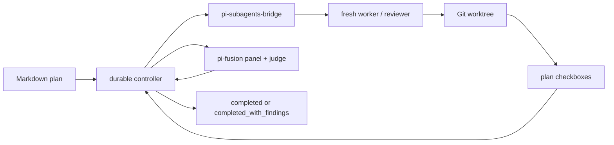

# pi-plan-exec

<!-- markdownlint-disable MD013 -->

[](https://www.npmjs.com/package/@alexeiled/pi-plan-exec)
[](https://github.com/alexei-led/pi-plan-exec/actions/workflows/ci.yml?query=branch%3Amain)
[](https://github.com/alexei-led/pi-plan-exec/actions/workflows/release.yml)
[](https://nodejs.org/)
[](LICENSE)

**Give Pi a plan. Get an isolated branch, sequential implementation, adversarial reviews, and a resumable run record.**

`pi-plan-exec` turns a checkbox plan into a controlled execution pipeline. It
runs one fresh worker at a time, checks the plan instead of trusting “done,”
reviews the result through Pi subagents and Fusion, and survives session restarts
without intentionally starting a second writer.

Built for long-running AI coding work where a prompt alone is not a reliable
orchestrator.

> Experimental. Start in disposable repositories or reviewable worktrees until
> the package has seen more production plan runs.

## Why

A capable coding agent can still lose the thread across a long implementation:
repeat a task, skip a review, exceed a retry cap, write in the wrong checkout, or
forget what was running after the session restarts.

`pi-plan-exec` moves that control flow out of prompt prose and into a durable
state machine:

- **one writer** in one selected Git worktree;
- **fresh context** for every worker, reviewer, fixer, and stats pass;
- **checkbox truth** — implementation completes only when the plan says it does;
- **bounded review loops** with honest `completed_with_findings` outcomes;
- **crash-safe operation IDs**, leases, and cross-session adoption;
- **visible progress** through a pi-tasks projection and global run record.

## Quick start

Install the Pi packages:

```bash
pi install npm:pi-subagents
pi install npm:@tintinweb/pi-tasks
pi install npm:@alexeiled/pi-subagents-bridge
pi install npm:@alexeiled/pi-fusion
pi install npm:@alexeiled/pi-plan-exec
```

Reload Pi, then run a plan from inside a Git repository:

```text
/reload
/exec docs/plans/20260713-add-greeting.md
```

A minimal plan:

```markdown
# Add greeting

### Task 1: Add the greeting

- [ ] Create `greeting.txt` containing `hello`.
- [ ] Verify the file contents.
```

`/exec` asks whether to run in place or in an isolated worktree. Prefer the
worktree. Omit the path to choose a plan interactively from `docs/plans/`.

## What you get

- **Sequential implementation** — the first incomplete task runs; later tasks wait.
- **Strict plan validation** — ordered task/iteration headings and checkbox items.
- **Git isolation** — worktrees live outside the source repository under `~/.pi/plan-exec/worktrees/`.
- **Ralphex-style review pipeline** — comprehensive, smells, Fusion, and critical review/fix stages.
- **Durable recovery** — run records under `~/.pi/plan-exec/runs/` survive Pi sessions.
- **Safe adoption** — a stale run can be claimed without replacing an active foreign-session child.
- **pi-tasks visibility** — each session gets a task projection; it is not a second executor.
- **No cc-thingz dependency** — uses pi-subagents' built-in `worker` and `reviewer` agents.

## How it works



The controller owns stage order, retry limits, leases, and recovery. Existing Pi
extensions keep ownership of model execution, task UI, and panel review. See the
[architecture](docs/architecture.md) for the contracts and state model.

## Commands

```text
/exec <plan>            Start a run
/exec                   Select and start a plan
/exec runs              List recent runs
/exec status <run-id>   Show stage, branch, and worktree
/exec pause <run-id>    Finish the active child, then pause
/exec resume <run-id>   Continue a paused run
/exec adopt <run-id>    Claim a stale cross-session run
/exec cancel <run-id>   Stop when safe and keep the worktree
```

## Read next

- **[Guide](docs/guide.md)** — installation, plan format, commands, recovery, and safety.
- **[Architecture](docs/architecture.md)** — ownership, data flow, state, stages, and trust boundaries.
- [Development](DEVELOPMENT.md) — local checks and trusted-publishing releases.
- [Original design record](docs/plans/2026-07-12-pi-plan-exec-design.md) — detailed design discussion.

## License

[MIT](LICENSE)
