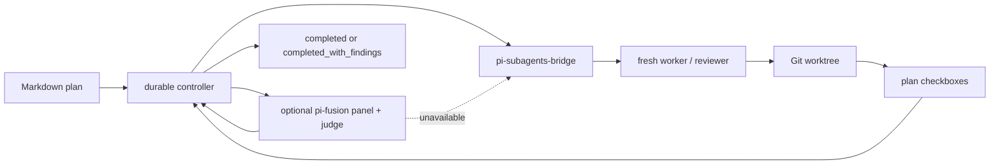

# pi-plan-exec

<!-- markdownlint-disable MD013 -->

[](https://www.npmjs.com/package/@alexeiled/pi-plan-exec)
[](https://github.com/alexei-led/pi-plan-exec/actions/workflows/ci.yml?query=branch%3Amain)
[](https://github.com/alexei-led/pi-plan-exec/actions/workflows/release.yml)
[](https://nodejs.org/)
[](https://github.com/alexei-led/pi-plan-exec/blob/main/LICENSE)

**Turn a Markdown execution plan into an isolated, resumable Pi run.**

`pi-plan-exec` solves the control problem of long-running AI implementation.
A capable agent can lose context, repeat work, skip verification, or start a
second writer after a restart. This extension moves task order, retry limits,
worktree checks, and recovery out of prompt prose into durable controller state.
It has been exercised in runs lasting a few hours; the controller keeps polling
instead of asking one chat prompt to remember the whole job.

It executes one checked-list task at a time in a Git checkout you choose, then
runs review and fix stages with fresh Pi subagents and optional Fusion. A worker saying
“done” is not enough: the plan’s checked items are the implementation record.

> Experimental. Start with disposable repositories or reviewable worktrees.

## What it does

- **Keeps one writer in one checkout.** `/exec` can create an isolated Git
  worktree, work in place, or use an explicitly selected existing
  worktree. Existing-worktree runs keep that worktree and branch, and move the
  interactive Pi session there.
- **Executes plans deterministically.** It selects the first incomplete task,
  starts a fresh worker, and verifies completion from the plan checkboxes.
- **Recovers deliberately.** A reload reattaches a matching run owned by the
  returning session. `/exec resume` takes over a run whose owning session is
  proven dead, and resets a run whose worker is provably gone before continuing
  it. Compare-and-set records, operation IDs, controller locks, and leases avoid
  intentionally starting another writer or losing a pause or cancellation.
- **Reviews before it finishes.** It runs comprehensive, smells, Fusion, and
  critical review/fix phases. Fusion `>=0.7.0` validates the strict
  `plan-review-v1` output contract; plan-exec consumes only top-level
  `callerOutput.output` and fails closed when validation evidence is absent. If
  Fusion is unavailable, the Fusion review stage falls back to the pi-subagents
  reviewer without changing the persisted operation ID. Unresolved findings
  remain visible in the final `completed_with_findings` state.

## Install and run

Install the required packages, then plan-exec. Fusion is optional; install it for the preferred Fusion review provider:

```bash
pi install npm:pi-subagents
pi install npm:@tintinweb/pi-tasks
pi install npm:@alexeiled/pi-subagents-bridge
pi install npm:@alexeiled/pi-fusion
pi install npm:@alexeiled/pi-plan-exec
```

The providers remain independent Pi packages. Install the latest Bridge release. `pi-plan-exec` uses v2 durable lookup and terminal proof when advertised; v1 remains compatible but fails closed when recovery cannot prove a launch outcome.
Fusion is optional: the controller falls back to the pi-subagents reviewer when
Fusion is absent or its launch response is unusable.

Reload Pi. From an interactive session in a Git repository, prepare a short goal
or run an existing executable plan:

```text
/reload
/goal Add a greeting endpoint
/exec docs/plans/20260713-add-greeting.md
/exec --worktree ../project-feature docs/plans/20260713-add-greeting.md
```

`/goal <short goal>` uses the current Pi session for read-only repository
exploration (with an enforced maximum of 12 `read` tool calls), then permits
only the extension-owned `finalize_goal_plan` tool to
publish a researched Markdown plan under `docs/plans/`. The finalizer validates
the executable-plan parser contract, repository evidence, exact goal binding,
and stable `goal_id`, `goal_hash`, `plan_hash`, and `document_hash` metadata.
It atomically creates a complete file without overwriting an existing one. It
never creates a run, worktree, task projection, or child. A ready retry reuses
an unchanged validated file; an edited or incomplete file is refused. A turn
that ends before finalization is reported as interrupted and publishes no plan.
The ready result has exactly one next action: `/exec <path>`.

While an execution runs, Pi shows the execution-worktree path, branch, stage, and worker.
Four verbs cover everything after the start:

- `/exec status` never interrupts or restarts a run. It may idempotently repair
  the advisory pi-tasks and Fleet visibility caches from `run.json`. With no
  run ID it lists every run, groups the ones that claim a worker by the evidence
  for that claim, reports any missing package with its install command, and ends
  every row in one next command. Add a full run ID for one run in detail, or
  `--all` to include terminal runs older than a day.
- `/exec resume` continues or recovers anything stuck. It takes the lease over
  from a session proven dead, resets a run whose worker is provably gone and then
  continues it, and asks before retrying a task blocked outside the run or
  rebinding the execution branch after external work moved the worktree. It never
  launches on partial evidence: a run whose worker cannot be proven gone is
  reported, not reset. A model or provider failure is retried with the model this
  Pi session is signed in to and does not consume an implementation retry;
  `--model current` or `--model provider/model` is an advanced override for that
  one replacement child and never pins later workers. When a child pauses for a
  supervisor reply, the live controller preserves and polls that workflow, then
  continues automatically after the reply. After a restart, resume consumes its
  durable result or reattaches the same operation; it does not launch a
  duplicate. Missing bridge memory, a missing async directory, and v1 absence
  are inconclusive; only matching v2 durable absence or native process-terminal
  proof permits recovery to launch again.
- `/exec stop` asks whether to pause the run (resumable) or cancel it (final,
  worktree preserved).
- `/exec cleanup` retires run records. It previews by default and deletes
  nothing; `--apply` removes the registry entry — never the worktree, branch, or
  progress file — for terminal runs that finished more than 7 days ago.
  `failed` runs are excluded, because their record is what `/exec resume` needs.

Implementation checkboxes remain sequential and cannot be force-skipped. When a
provider operation may still exist, plan-exec keeps its recorded operation ID and
reconciles it before any retry. If a review, finalization, or statistics stage
cannot recover, `/exec skip <full-run-id> --reason <text>` stops the tracked
child before recording an explicit waiver and advancing. It never skips
implementation or archival, and the run finishes as `completed_with_findings`.
The installed `exec-plan` skill is also available as `/skill:exec-plan` for the
plan format, the recovery rules, and the retired names and flags a scripted agent
uses instead of a prompt.

The **[Guide](docs/guide.md#executable-plan-format)** defines the accepted
heading-based formats and checkbox rules. Omit the path to select an eligible
Markdown plan below `docs/plans/`.

## Runtime model


```mermaid
flowchart LR
    plan["Markdown plan"] --> controller["durable controller"]
    controller --> bridge["pi-subagents-bridge"]
    bridge --> worker["fresh worker / reviewer"]
    worker --> worktree["Git worktree"]
    worktree --> checks["plan checkboxes"]
    checks --> controller
    controller --> fusion["optional pi-fusion panel + judge"]
    fusion -. unavailable .-> bridge
    fusion --> controller
    controller --> result["completed or completed_with_findings"]
```

`pi-plan-exec` owns plan-specific control flow. Existing Pi packages retain
ownership of subagent execution, task UI, and multi-model review.

## Read next

- **[Guide](docs/guide.md)** — requirements, executable-plan format, commands,
  lifecycle, recovery, and safety limits.
- **[Architecture](docs/architecture.md)** — component ownership, state, RPC
  contracts, stages, and trust boundaries.
- [Development](DEVELOPMENT.md) — local verification and release process.
- [Changelog](CHANGELOG.md) — release history and compatibility changes.
- [Original design record](docs/plans/2026-07-12-pi-plan-exec-design.md) —
  design decisions and intended behavior.

## License

[MIT](LICENSE)
