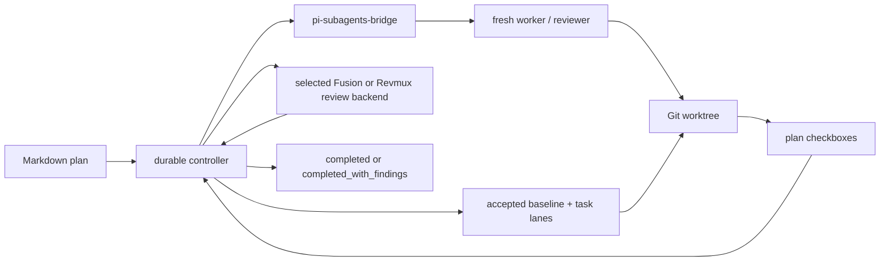

# pi-plan-exec

<!-- markdownlint-disable MD013 -->

[](https://www.npmjs.com/package/@alexeiled/pi-plan-exec)
[](https://github.com/alexei-led/pi-plan-exec/actions/workflows/ci.yml?query=branch%3Amain)
[](https://github.com/alexei-led/pi-plan-exec/actions/workflows/release.yml)
[](https://nodejs.org/)
[](https://github.com/alexei-led/pi-plan-exec/blob/main/LICENSE)

**Turn a Markdown execution plan into an isolated, resumable Pi run.**

`pi-plan-exec` solves the control problem of long-running AI implementation.
A capable agent can lose context, repeat work, skip verification, or start a
second writer after a restart. This extension moves task order, automatic
recovery, worktree checks, commit acceptance, and provider reconciliation out of
prompt prose into durable controller state.
The controller keeps polling instead of asking one chat prompt to remember the
whole job, but the strict runtime contract is not yet satisfied by the tested
providers.

It executes ready checked-list tasks in a Git checkout you choose, then runs
the required review and fix stages with fresh Pi subagents or an explicitly
selected review backend. A worker saying “done” is not enough: the plan’s
checked items, accepted commit, required checks, and a clean worktree with no
uncommitted or untracked non-ignored files are the implementation record.

> Experimental implementation draft. The strict controller requires the new
> `pi-subagents/kernel-owned-process` Darwin runtime and matching Bridge,
> Fusion, and Revmux ownership contracts. Host smoke evidence exists, and the
> native source pin is under review, but package publication is still pending;
> unsupported APIs and unknown ownership remain fenced. Do not treat the latest
> npm package as ready for autonomous production runs; see [runtime contracts](docs/runtime-contracts.md).

Local bootstrap and required-check batches run through the same kernel-owned
executor, with unbounded user-stoppable lifetime and durable retirement proof.
They remain unavailable when the exact native dependency is missing.

## What it does

- **Keeps one writer per execution lane.** `/exec` can create an isolated Git
  worktree, work in place, or use an explicitly selected existing
  worktree. Existing-worktree runs keep that worktree and branch, and move the
  interactive Pi session there.
- **Executes plans deterministically.** It selects the next dependency-ready
  task, starts a fresh worker, and verifies completion from a committed plan
  candidate.
- **Recovers deliberately.** A reload reattaches a matching run owned by the
  returning session. `/exec resume` takes over a run whose owning session is
  proven dead, and reconciles its existing operation before continuing it.
  Compare-and-set records, operation IDs, controller locks, and leases avoid
  intentionally starting another writer or losing a pause or cancellation.
- **Requires a valid candidate before completion.** A task is accepted only
  after its committed plan checkboxes, ancestry, frozen required checks, and a
  clean worktree with no uncommitted or untracked non-ignored files are
  verified. The default review is one required
  subagent reviewer; blocking findings remain unmet and schedule recovery.
- **Schedules dependencies and preserves partial work.** Omitted `dependsOn`
  metadata keeps legacy sequential order. `dependsOn: []` declares an
  independent task. A failed partial task stays in its lane while an eligible
  independent task can use a clean lane from the last accepted commit.
  Completed lane work is promoted back to the original output branch by a
  guarded fast-forward before review.

## Install and run

Use a project-local source checkout with the exact dependency Git refs listed
in [runtime contracts](docs/runtime-contracts.md). This pre-release path is not
provided by the published npm runtime; do not install the latest provider
versions and assume that they expose the required native contract. The exact
native pin is recorded in the runtime contract and remains under review until
the linked dependency PR publishes the public API. Fusion and Revmux are optional explicit review backends; the
default backend is one required subagent reviewer. `@tintinweb/pi-tasks` is an
optional projection cache.

The providers remain independent Pi packages. This incomplete implementation
draft is tested against the exact dependency commits and linked dependency PRs
listed in [runtime contracts](docs/runtime-contracts.md). The default
review backend is `subagent` with an empty fallback list (`none`). An ambiguous
Fusion or Revmux launch keeps its operation ID and remains recoverable instead
of starting another reviewer over an unknown child. The development checkout
and CI use npm 12.0.2. The repository `.npmrc` uses `allow-git=root`; a packed
consumer must use a project-local `allow-git=all` for transitive Git refs. Do
not change global npm configuration.

Reload Pi. From an interactive session in a Git repository, prepare a short goal
or run an existing executable plan:

```text
/reload
/goal Add a greeting endpoint
/exec docs/plans/20260713-add-greeting.md
/exec --worktree ../project-feature docs/plans/20260713-add-greeting.md
```

`/goal <short goal>` uses the current Pi session for read-only repository
exploration (with an enforced maximum of 12 `read` tool calls), then permits
only the extension-owned `finalize_goal_plan` tool to
publish a researched Markdown plan under `docs/plans/`. The finalizer validates
the executable-plan parser contract, repository evidence, exact goal binding,
and stable `goal_id`, `goal_hash`, `plan_hash`, and `document_hash` metadata.
It atomically creates a complete file without overwriting an existing one. It
never creates a run, worktree, task projection, or child. A ready retry reuses
an unchanged validated file; an edited or incomplete file is refused. A turn
that ends before finalization is reported as interrupted and publishes no plan.
The ready result has exactly one next action: `/exec <path>`.

While an execution runs, Pi shows the execution-worktree path, branch, stage, and worker.
Four verbs cover everything after the start:

- `/exec status` never interrupts or restarts a run. It may idempotently repair
  the advisory pi-tasks and Fleet visibility caches from `run.json`. With no
  run ID it lists every run, groups the ones that claim a worker by the evidence
  for that claim, reports any missing package with its install command, and ends
  every row in one next command. Add a full run ID for one run in detail, or
  `--all` to include terminal runs older than a day.
- `/exec resume` continues or recovers anything stuck. It takes the lease over
  from a session proven dead, reconciles the existing operation when its worker
  is provably gone and then continues it, and asks before retrying a task blocked outside the run or
  rebinding the execution branch after external work moved the worktree. It never
  launches on partial evidence: a run whose worker cannot be proven gone is
  reported, not reconciled. A model or provider failure is retried with the model this
  Pi session is signed in to and does not consume an implementation retry;
  `--model current` or `--model provider/model` is an advanced override for that
  one replacement child and never pins later workers. When a child pauses for a
  supervisor reply, the live controller preserves and polls that workflow, then
  continues automatically after the reply. After a restart, resume consumes its
  durable result or reattaches the same operation; it does not launch a
  duplicate. Missing bridge memory, a missing async directory, and v1 absence
  are inconclusive; only a matching owned-tree terminal proof, an authoritative
  never-started fence, or v2 durable absence for an unbound launch permits
  recovery to launch again.
- `/exec stop` asks whether to pause the run (resumable) or cancel it (final,
  worktree preserved).
- `/exec cleanup` retires run records. It previews by default and deletes
  nothing; `--apply` removes the registry entry — never the worktree, branch, or
  progress file — for terminal runs that finished more than 7 days ago.
  `failed` runs are excluded, because their record is what `/exec resume` needs.

After Pi starts or reloads, the native controller restores unfinished runs when
their lease is claimable and reattaches durable operations by ID. Its widget and
`/exec status` show task counts, dependency/retry waits, the next automatic
action, verified activity, cumulative usage, selected review backend, and
lifetime. Optional task projections are visibility caches and cannot gate
recovery. Statistics are deterministic usage/task bookkeeping by default;
`statsEnabled: true` opts into an additional report child.

A worker that reports `<<<RALPHEX:TASK_FAILED>>>` with incomplete checkboxes
keeps the run in automatic recovery with its blocker reason. The controller
schedules another evidence-gathering attempt with backoff; diagnostic status
failure counters do not become a terminal retry cap or a second writer. The
worktree, accepted commits, and completed tasks are preserved; a successful
workflow transport result does not mean the task succeeded.

When the worker supplies an observed `Prerequisite:` value of `credentials`,
`permission`, `missing_executable`, or `runtime` together with `Evidence:`,
the task enters `waiting_external` and receives an automatic wake. Generic
blocker wording does not create that classification.

Task dependencies control eligibility, while plan-exec still runs one child at
a time per controller and keeps one writer per lane. When a provider operation
may still exist, plan-exec keeps its recorded operation ID and reconciles it
before any retry. If an optional review, finalization, or statistics stage
cannot recover, `/exec skip <full-run-id> --reason <text>` stops the tracked
child before recording an explicit waiver and advancing. Required review and
final verification cannot be skipped; implementation and archival never can.
The run finishes as `completed_with_findings`.
The installed `exec-plan` skill is also available as `/skill:exec-plan` for the
plan format, the recovery rules, and the retired names and flags a scripted agent
uses instead of a prompt.

The **[Guide](docs/guide.md#executable-plan-format)** defines the accepted
heading-based formats and checkbox rules. Omit the path to select an eligible
Markdown plan below `docs/plans/`.

## Runtime model


```mermaid
flowchart LR
    plan["Markdown plan"] --> controller["durable controller"]
    controller --> bridge["pi-subagents-bridge"]
    bridge --> worker["fresh worker / reviewer"]
    worker --> worktree["Git worktree"]
    worktree --> checks["plan checkboxes"]
    checks --> controller
    controller --> lanes["accepted baseline + task lanes"]
    lanes --> worktree
    controller --> fusion["selected Fusion or Revmux review backend"]
    fusion --> controller
    controller --> result["completed or completed_with_findings"]
```

`pi-plan-exec` owns plan-specific control flow. Existing Pi packages retain
ownership of subagent execution, task UI, and multi-model review.

## Read next

- **[Guide](docs/guide.md)** — requirements, executable-plan format, commands,
  lifecycle, recovery, and safety limits.
- **[Architecture](docs/architecture.md)** — component ownership, state, RPC
  contracts, stages, and trust boundaries.
- [Development](DEVELOPMENT.md) — local verification and release process.
- [Changelog](CHANGELOG.md) — release history and compatibility changes.
- [Original design record](docs/plans/2026-07-12-pi-plan-exec-design.md) —
  design decisions and intended behavior.

## License

[MIT](LICENSE)
