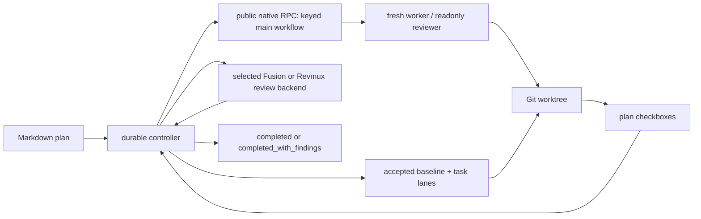

# pi-plan-exec

<!-- markdownlint-disable MD013 -->

[](https://www.npmjs.com/package/@alexeiled/pi-plan-exec)
[](https://github.com/alexei-led/pi-plan-exec/actions/workflows/ci.yml?query=branch%3Amain)
[](https://github.com/alexei-led/pi-plan-exec/actions/workflows/release.yml)
[](https://nodejs.org/)
[](https://github.com/alexei-led/pi-plan-exec/blob/main/LICENSE)

**Turn a Markdown execution plan into an isolated, resumable Pi run.**

`pi-plan-exec` solves the control problem of long-running AI implementation.
A capable agent can lose context, repeat work, skip verification, or start a
second writer after a restart. This extension moves task order, automatic
recovery, worktree checks, commit acceptance, and provider reconciliation out of
prompt prose into durable controller state.
The controller keeps polling and reconciles durable operations after a restart.
The default subagent backend uses the strict runtime contract on POSIX hosts
with the prerequisites and limits documented below.

It executes ready checked-list tasks in a Git checkout you choose, then runs
the required review and fix stages with fresh Pi subagents or an explicitly
selected review backend. A worker saying “done” is not enough: the plan’s
checked items, accepted commit, required checks, and a clean worktree with no
uncommitted or untracked non-ignored files are the implementation record.

> The default backend targets unmodified `pi-subagents@0.76.1`; no upstream
> patch, Bridge, pi-tasks or cc-thingz is required. Unknown launch or retirement
> evidence remains fenced. See [runtime contracts](docs/runtime-contracts.md).

Local bootstrap and required-check batches run through plan-exec's owned POSIX
process-group runner, with unbounded user-stoppable lifetime and durable
writer-exit retirement proof. Detached descendants that leave the process group
are best-effort, matching the released runtime.

## What it does

- **Keeps one writer per execution lane.** `/exec` can create an isolated Git
  worktree, work in place, or use an explicitly selected existing
  worktree. Existing-worktree runs keep that worktree and branch, and move the
  interactive Pi session there.
- **Executes plans deterministically.** It selects the next dependency-ready
  task, starts a fresh worker, and verifies completion from a committed plan
  candidate.
- **Recovers deliberately.** A reload reattaches a matching run owned by the
  returning session. `/exec resume` takes over a run whose owning session is
  proven dead, and reconciles its existing operation before continuing it.
  Compare-and-set records, operation IDs, controller locks, and leases avoid
  intentionally starting another writer or losing a pause or cancellation.
- **Requires a valid candidate before completion.** A task is accepted only
  after its committed plan checkboxes, ancestry, frozen required checks, and a
  clean worktree with no uncommitted or untracked non-ignored files are
  verified. The default review is one required
  subagent reviewer; blocking findings remain unmet and schedule recovery.
- **Schedules dependencies and preserves partial work.** Omitted `dependsOn`
  metadata keeps legacy sequential order. `dependsOn: []` declares an
  independent task. A failed partial task stays in its lane while an eligible
  independent task can use a clean lane from the last accepted commit.
  Completed lane work is promoted back to the original output branch by a
  guarded fast-forward after required review and verification.

## Install and run

Requires Pi `^1.0.4` (1.0.4 or later in the 1.x series).
The development baseline is Pi `1.0.4` and `pi-subagents@0.76.1`. Install them as independent Pi
packages; no Git dependency or `allow-git=all` setting is required:

```bash
pi install -l npm:pi-subagents@0.76.1
pi install -l /absolute/path/to/pi-plan-exec
```

The default review backend is one required readonly `plan-exec-reviewer`, registered
through public native runtime-agent events, with an empty
fallback list (`none`). Fusion `0.9.3` is the tested baseline; that stack does
not satisfy this extension's strict review ownership contract. Compatibility
requires advertised lifetime, durable lookup and process-tree proof capabilities;
a newer version alone does not establish support. Revmux's required lifecycle
support is still in an unmerged PR. Use these backends only with a verified
runtime contract; see [runtime contracts](docs/runtime-contracts.md).
Task summaries come from `run.tasks`; Fleet is advisory. No task-store package is used.
The development checkout and CI use npm 12.0.2.

Pi supplies its SDK, TUI and TypeBox modules. This extension declares the SDK
as a tested `^1.0.4` peer and TUI/TypeBox as `"*"` peers, never private runtime
dependencies. pi-subagents is an optional versioned peer for its runtime APIs. If startup reports **“Host-provided
extension packages must be declared in peerDependencies”**, check the
`package.json` path in the warning: another installed extension can cause it.
Update or fix that package's declarations; do not suppress the warning or add
private SDK copies here. See the [upstream audit](docs/upstream-audit.md) for
known dependency limitations and upgrade priorities.

Restart Pi after package upgrades. `/reload` is for local source/config changes.
Legacy records are read-only data, not another backend. Already-bound native IDs
need no journal. Unbound records can explicitly import a consistent offline
schema-7 snapshot:

```text
/exec resume <full-run-id> --legacy-journal /absolute/path/to/offline.sqlite
```

Import preserves the original request/digest and cannot authorize replay, erase
stop intent or revive abandoned runs. Never copy only the main file of a live
WAL database. No default live journal is opened or migrated.

New model operations use one keyed native workflow and unique run-owned output.
Requested `maxTurns` settings are recorded but unsupported by native RPC 0.76.1.
Unbounded workflow mode does not remove native child defaults. Bounded timeout is
passed to both root and child; observed limits and retirement remain evidence,
not assumptions. Typed review must match the exact commit; missing reports fail.

From an interactive session in a Git repository, start a goal or run a plan:

```text
/reload
/goal Fix the failing tests
/goal Add a greeting endpoint --check "npm test"
/exec docs/plans/20260713-add-greeting.md
/exec --worktree ../project-feature docs/plans/20260713-add-greeting.md
```

`/goal <goal text>` pursues a goal autonomously in place on the current branch
and needs no plan file or checkbox list. It requires a clean worktree and at
least one required check, auto-detected from the project or supplied with
`--check "<command>"`. The controller runs one worker turn per iteration through
the same owned runtime, registry, leases, stop fences, and recovery as `/exec`:
the worker inspects the state, chooses and executes the next useful action, and
commits. An ordinary turn summary is an intermediate answer and the controller
schedules the next turn automatically. A completion claim only starts
verification: the required checks, then the configured review and final
verification, must pass on the committed work. Deleting test files or adding
`skip`/`only` markers pauses completion for confirmation; three turns without
progress pause the goal with a recorded reason, and a blocker pauses it until
`/goal resume <run-id>`. `/goal status`, `/goal pause`, `/goal cancel`, and
`/goal help` manage the run.

## Progress without the noise

Pi shows a two-line progress strip: plan title, state, accepted task count and
current action. Green means healthy running or complete. Amber means waiting,
uncertain or stopping. Failures are red; paused/cancelled runs are muted.
Text and symbols carry the same meaning without color. In-flight runs are shown
as amber snapshots unless this session's local controller owns and polls them.
Snapshots retain the saved execution label, such as **Cancelling · Snapshot**.
A snapshot is not a claim that the worker is healthy or still running.
An observed operation pause is amber, not green Working. If one task waits on
a prerequisite while another runs, the strip shows both work and the wait.

- `/exec ui off` removes the strip and footer immediately. Execution continues.
- `/exec ui on` restores the display, without resuming execution.
- Legacy `hide` and `show [run-id]` remain compatibility aliases.
- `/exec clear [run-id]` dismisses the displayed run, without deleting its record.
- These display actions need no `--apply`. They survive reload in the same
  session. Updates cannot undo a hide or a per-run dismissal.
- `/exec status [run-id]` keeps paths, owners, diagnostics, usage and evidence
  available on demand.

See [live Pi screenshots and checks](docs/ui-validation.md).

Run controls are separate from display controls:

- `/exec status` never interrupts or restarts a run. It may idempotently repair
  advisory Fleet visibility and task summaries from `run.json`. With no
  run ID it lists every run, groups the ones that claim a worker by the evidence
  for that claim, reports any missing package with its install command, and ends
  every row in one next command. Add a full run ID for one run in detail, or
  `--all` to include terminal runs older than a day.
- `/exec resume` continues or recovers anything stuck. It takes the lease over
  from a session proven dead, reconciles the existing operation when its worker
  is provably gone and then continues it, and asks before retrying a task blocked outside the run or
  rebinding the execution branch after external work moved the worktree. It never
  launches on partial evidence: a run whose worker cannot be proven gone is
  reported, not reconciled. A model or provider failure is retried with the model this
  Pi session is signed in to and does not consume an implementation retry;
  `--model current` or `--model provider/model` is an advanced override for that
  one replacement child and never pins later workers. When a child pauses for a
  supervisor reply, the live controller preserves and polls that workflow, then
  continues automatically after the reply. After a restart, resume consumes its
  durable result or reattaches the same operation; it does not launch a
  duplicate. Missing native correlation, a missing async directory, and legacy absence
  are inconclusive; only a matching owned-tree terminal proof, an authoritative
  local never-started fence permits
  recovery to launch again.
- `/exec recover-isolated <full-run-id> <absolute-new-checkout>` previews an
  explicitly different recovery contract for local implementation tasks. `--apply`
  asks for confirmation, preserves the same logical run, quarantines the old
  operation/tree, and prepares an independent repository from the verified accepted
  commit. It does not prove the old worker stopped or import unaccepted edits.
  Activation leaves the run paused; continue from the new checkout with ordinary
  `/exec resume`. No shared Git metadata, object alternates, or old push remote is
  retained. This is not a security sandbox; refuse external-side-effect tasks.
  Quarantined trees remain reserved and prevent record cleanup.
- `/exec pause [run-id]` stops the current attempt and keeps it resumable.
- `/exec stop [run-id]` requests final cancellation, without a dialog.
  It stays `cancel_pending` until worker retirement is proven.
- `/exec stop <full-run-id> --force` permanently ends controller management,
  including unresolved legacy launches. It dismisses the run across sessions
  and restarts, revokes new work and result acceptance, and attempts cancellation
  of the exact tracked operation. It does **not** claim an unknown worker died.
  A live foreign controller refuses the command: use its owning session.
  Eligible registry artifacts are removed after a durable backup; unknown
  operations/local commands/quarantined checkouts retain their ownership record
  and reservation. Worktrees, branches, progress files and provider journals
  are never deleted. See [force-stop recovery](skills/exec-plan/references/recovery.md#permanent-force-stop).
  `cancel` remains a deprecated alias for ordinary `stop`.
- `/exec cleanup` retires run records. It previews by default and deletes
  nothing; `--apply` removes the registry entry — never the worktree, branch, or
  progress file — for terminal runs that finished more than 7 days ago.
  `failed` runs are excluded, because their record is what `/exec resume` needs.

After Pi starts or reloads, the native controller restores unfinished runs when
their lease is claimable and reattaches durable operations by ID. The strip
shows current state; `/exec status` holds detailed evidence. Cancellation intent
wins over an old task state: the strip says “Cancelling” until worker exit is
confirmed, unless the operator ends management with `stop --force`. Abandoned
runs are hidden from the default list; inspect them by ID or with `status --all`.
Native control distinguishes stop intent from delivery. Neither is exit proof. Advisory Fleet visibility cannot gate
recovery. Statistics are deterministic usage/task bookkeeping by default;
`statsEnabled: true` opts into an additional report child.

A worker that reports `<<<RALPHEX:TASK_FAILED>>>` with incomplete checkboxes
keeps the run in automatic recovery with its blocker reason. The controller
schedules another evidence-gathering attempt with backoff; diagnostic status
failure counters do not become a terminal retry cap or a second writer. The
worktree, accepted commits, and completed tasks are preserved; a successful
workflow transport result does not mean the task succeeded.

When the worker supplies an observed `Prerequisite:` value of `credentials`,
`permission`, `missing_executable`, or `runtime` together with `Evidence:`,
the task enters `waiting_external` and receives an automatic wake. Generic
blocker wording does not create that classification.

Task dependencies control eligibility, while plan-exec still runs one child at
a time per controller and keeps one writer per lane. When a provider operation
may still exist, plan-exec keeps its recorded operation ID and reconciles it
before any retry. If an optional review or statistics stage
cannot recover, `/exec skip <full-run-id> --reason <text>` stops the tracked
child before recording an explicit waiver and advancing. Required review and
final verification cannot be skipped; implementation and archival never can.
The run finishes as `completed_with_findings`.
The installed `exec-plan` skill is also available as `/skill:exec-plan` for the
plan format, the recovery rules, and the retired names and flags a scripted agent
uses instead of a prompt.

The **[Guide](docs/guide.md#executable-plan-format)** defines the accepted
heading-based formats and checkbox rules. Omit the path to select an eligible
Markdown plan below `docs/plans/`.

## Runtime model


```mermaid
flowchart LR
    plan["Markdown plan"] --> controller["durable controller"]
    controller --> native["public native RPC: keyed main workflow"]
    native --> worker["fresh worker / readonly reviewer"]
    worker --> worktree["Git worktree"]
    worktree --> checks["plan checkboxes"]
    checks --> controller
    controller --> lanes["accepted baseline + task lanes"]
    lanes --> worktree
    controller --> fusion["selected Fusion or Revmux review backend"]
    fusion --> controller
    controller --> result["completed or completed_with_findings"]
```

`pi-plan-exec` owns plan-specific control flow. Existing Pi packages retain
ownership of subagent execution, task UI, and multi-model review.

## Read next

- **[Guide](docs/guide.md)** — requirements, executable-plan format, commands,
  lifecycle, recovery, and safety limits.
- **[Architecture](docs/architecture.md)** — component ownership, state, RPC
  contracts, stages, and trust boundaries.
- [Development](DEVELOPMENT.md) — local verification and release process.
- [Changelog](CHANGELOG.md) — release history and compatibility changes.
- [Historical design record](docs/plans/2026-07-12-pi-plan-exec-design.md) —
  the original design before autonomous recovery.

## License

[MIT](LICENSE)
