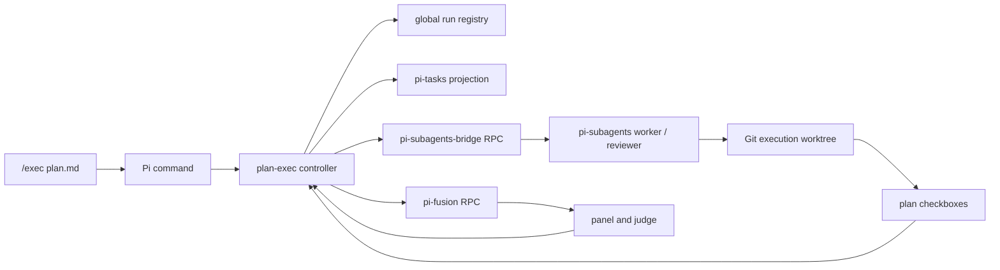

# pi-plan-exec Architecture

<!-- markdownlint-disable MD013 -->

`pi-plan-exec` is a deterministic controller around existing Pi extensions. It
owns plan-specific policy and durable transitions, not model execution, task UI,
or multi-model review.

## Design goals

- deterministic stage order and retry limits;
- one writer at a time in one execution worktree;
- fresh model context for every implementation, review, and fix operation;
- crash-safe replay without duplicate writer starts;
- cross-session recovery and adoption;
- existing Pi extensions remain the owners of their domains.

## Component ownership

| Component             | Owns                                                                                                            |
| --------------------- | --------------------------------------------------------------------------------------------------------------- |
| `pi-plan-exec`        | Plan parsing, Git safety, stages, retries, leases, recovery, prompts, findings, archival                        |
| `pi-subagents-bridge` | Versioned execution RPC, `cwd` forwarding, spawn idempotency, run observation, result normalization, stop/adopt |
| `pi-subagents`        | Fresh child sessions, built-in `worker`/`reviewer`, model execution, artifacts, lifecycle                       |
| `pi-fusion`           | Panel, judge, profiles, machine-readable Fusion RPC, persistent operation identity                              |
| `pi-tasks`            | Task file format, locking, dependencies, session widget                                                         |

The bridge and Fusion APIs are event-based, versioned RPC contracts. The
controller does not import their runtime internals.

The exception is the pi-tasks projection adapter. Pi-tasks has no cross-extension
CRUD RPC, so `task-projection.ts` uses the shipped `TaskStore` contract. The
adapter validates the methods it needs before writing. Pi-tasks is never the
controller's authoritative state.

## Data flow



The controller re-reads the plan after implementation. A child saying “done” is
not completion evidence; checked plan items are.

## Source modules

| Module                   | Responsibility                                                                   |
| ------------------------ | -------------------------------------------------------------------------------- |
| `src/index.ts`           | `/exec` command surface, interactive selection, background controller loop       |
| `src/controller.ts`      | State transitions, operation launch/observation, retries, cancellation, recovery |
| `src/types.ts`           | Run, stage, operation, finding, and frozen configuration contracts               |
| `src/registry.ts`        | Locked atomic run persistence, migration, leases, adoption                       |
| `src/plan.ts`            | Strict Markdown plan parser and structure hash                                   |
| `src/git.ts`             | Repository, branch, dirty-state, common-dir, and worktree safety                 |
| `src/bridge.ts`          | Typed client for `plan-exec:bridge:v1`                                           |
| `src/fusion.ts`          | Typed client for `fusion:rpc:v1`                                                 |
| `src/task-projection.ts` | Session pi-tasks projection and rebuild                                          |
| `src/artifact.ts`        | Subagent output/result fallback extraction                                       |
| `src/review.ts`          | Structured finding parsing and severity decisions                                |
| `src/progress.ts`        | `.ralphex/progress/` execution log                                               |

## Authoritative state

Run records live at:

```text
~/.pi/plan-exec/runs/<run-id>/run.json
```

Writes use compare-and-set updates under tokenized lock files plus temporary-file
rename. Controller transitions use a per-run lock; stale reload instances cannot
blindly overwrite newer pause, cancellation, or operation state. Each record
includes:

- repository, worktree, branch, and plan structure hash;
- status and current stage;
- task and stage attempt counters;
- active operation ID, external run ID, parameters, and result location;
- review and unresolved findings;
- pending and completed force-skip audit records;
- explicit execution-branch rebindings;
- frozen role/model limits;
- session lease and heartbeat.

A session may claim a run when no lease exists, the lease belongs to that
session, or the prior lease is stale. The lease controls cross-session ownership;
compare-and-set updates and the per-run controller lock serialize same-session
reload instances.

## Crash safety

External starts follow this order:

1. Generate a durable operation ID.
2. Persist operation intent and replay parameters.
3. Call Bridge or Fusion with that operation ID.
4. Persist the returned external run ID.

If Pi stops between steps 2 and 4, or a start reply times out or is malformed,
recovery reconciles the same operation ID. Bridge `0.2.0` or later reports an
operation as `found`, `pending`, `unknown`, or `absent`; the controller only
attaches `found` work and refuses a blind replay for every other uncertain
outcome. Fusion retries its persisted operation ID. Active foreign-session runs
are observed rather than replaced.

## Stage pipeline

The controller uses these stages:

1. `resolve`
2. `project_tasks`
3. `branch`
4. `progress`
5. `implementation`
6. `comprehensive_review`
7. `smells_review`
8. `fusion_review`
9. `critical_review`
10. `finalize`
11. `stats`
12. `archive`
13. `complete`

Isolation is selected before the durable run is created. `isolation` remains in
the schema for migration and explicit transition handling.

Implementation repeatedly selects the first task with unchecked boxes and runs
one worker. Comprehensive and Fusion review can loop through findings and a sole
fixer. Smells and critical review are single-pass review/fix stages. Known
findings that survive caps are retained and produce `completed_with_findings`.

## Cancellation, pause, and force-skip

- `pause` allows the active external operation to finish, then removes it without
  advancing the stage.
- `cancel` requests Bridge/Fusion stop when possible, keeps polling through
  `cancel_pending`, retries provider errors without discarding operation state,
  and ends at `cancelled` only after the operation is terminal.
- Both preserve the execution worktree.
- `resume --adopt-current-branch` verifies the same repository, requires no
  active operation, and records an explicit branch rebind before resuming.
- `skip` is an interactive, auditable waiver for review, finalization, and
  statistics only. It first persists `skip_pending`, then stops and terminally
  reconciles any tracked operation before clearing it and advancing exactly one
  stage. Skipped stages retain current findings as unresolved and cause
  `completed_with_findings`; implementation and archive are not skippable.

The background loop serializes ticks per run. It temporarily hides active tools
from the main agent so projected pi-tasks rows are not interpreted as a second
execution queue.

## Trust boundaries

Untrusted boundaries are validated at entry:

- Markdown plans use strict headings, numbering, and checkbox rules.
- Registry run IDs must be UUID-shaped before path construction.
- Stored run records are schema-checked and migrated.
- Bridge/Fusion replies are parsed from `unknown`.
- Reviewer output must be `NO_FINDINGS` or structured findings.
- Git common-directory and branch checks protect writer stages.
- `src/types.ts` owns persisted run/status/stage/operation constants. ESLint
  rejects raw domain values in control-flow comparisons and non-trivial magic
  numbers in runtime source, keeping state-machine changes reviewable.

## Further design record

The implementation originated from the detailed design in
[`plans/2026-07-12-pi-plan-exec-design.md`](plans/2026-07-12-pi-plan-exec-design.md).
That document records the design discussion and broader intended behavior. This
file describes the current module boundaries and runtime contracts.
