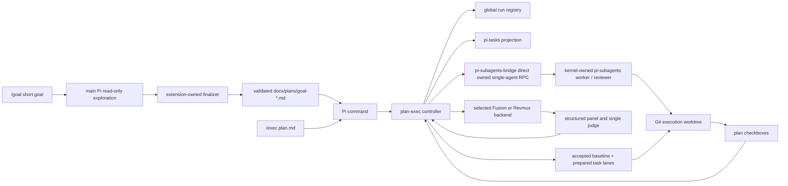

# pi-plan-exec Architecture

<!-- markdownlint-disable MD013 -->

`pi-plan-exec` is a deterministic controller around existing Pi extensions. It
owns plan-specific policy, durable transitions, automatic recovery, commit
acceptance, and provider reconciliation, not model execution or task UI.

The strict autonomous path
requires the public `pi-subagents/kernel-owned-process` Darwin dependency and
matching Bridge, Fusion, and Revmux ownership contracts. Exact source pins and
installed-runtime smoke evidence are available;
unsupported APIs and unknown ownership remain fenced. Local bootstrap and
required checks use the same unbounded kernel-owned executor. See [runtime
contracts](runtime-contracts.md) for API boundaries, prerequisites, and links.

## Design goals

- deterministic stage order and automatic recovery without a global retry cap;
- one child at a time, with one writer per execution lane;
- fresh model context for every implementation, review, and fix operation;
- crash-safe replay without duplicate writer starts;
- cross-session recovery and adoption;
- explicit dependency scheduling, accepted commit ancestry, and frozen checks;
- existing Pi extensions remain the owners of their domains.

## Component ownership

| Component | Owns |
| --- | --- |
| `pi-plan-exec` | Plan parsing, Git safety, stages, scheduled recovery, leases, accepted commits, frozen checks, lanes, prompts, findings, archival |
| `pi-subagents-bridge` | Versioned execution RPC, `cwd` forwarding, spawn idempotency, durable operation lookup, native process-terminal proof, run observation, result normalization, stop/adopt |
| `pi-subagents` | Fresh child sessions, built-in `worker`/`reviewer`, model execution, artifacts, lifecycle, external-run/background-work visibility registries |
| `pi-fusion` | Explicitly selected panel, judge, profiles, machine-readable Fusion RPC, validated caller output, persistent operation identity |
| `pi-tasks` | Task file format, locking, dependencies, session widget |

The bridge and Fusion APIs are event-based, versioned RPC contracts. The
controller does not import their runtime internals. Fusion review starts request
`outputContract: "plan-review-v1"`; terminal approval uses only validated
top-level `callerOutput.output` and fails closed when it is absent. An ambiguous
Fusion start retains the same operation ID and does not fall back over an
unknown child.

The exception is the pi-tasks projection adapter. Pi-tasks has no cross-extension
CRUD RPC, so `task-projection.ts` uses the shipped `TaskStore` contract. The
adapter validates the methods it needs before writing. Pi-tasks is never the
controller's authoritative state.

## Data flow

`/goal` is deliberately outside the execution controller. It temporarily narrows
the main Pi session to read-only repository tools (with at most 12 `read` calls)
and one extension-owned finalization tool. The tool alone validates and atomically publishes the ready
plan; it never creates a run record or talks to Bridge, Fusion, the projector,
or pi-subagents.


```mermaid
flowchart LR
    goal["/goal short goal"] --> explore["main Pi read-only exploration"]
    explore --> finalizer["extension-owned finalizer"]
    finalizer --> prepared["validated docs/plans/goal-*.md"]
    prepared --> command
    user["/exec plan.md"] --> command[Pi command]
    command --> controller[plan-exec controller]
    controller --> registry["global run registry"]
    controller --> projection[pi-tasks projection]
    controller --> bridge[pi-subagents-bridge direct owned single-agent RPC]
    bridge --> agents["kernel-owned pi-subagents worker / reviewer"]
    controller --> fusion[selected Fusion or Revmux backend]
    fusion --> panel[structured panel and single judge]
    agents --> worktree[Git execution worktree]
    panel --> controller
    worktree --> plan[plan checkboxes]
    plan --> controller
    controller --> lanes[accepted baseline + prepared task lanes]
    lanes --> worktree
```

The controller re-reads the plan after implementation. A child saying “done” is
not completion evidence; committed checked plan items are. Omitted task
dependencies preserve legacy sequential ordering, while `dependsOn: []` marks
an independent task. For an incomplete task, a leading
`<<<RALPHEX:TASK_FAILED>>>` records the blocker and schedules automatic
recovery while keeping the run owned. It does not create a global pause or
terminal retry cap. Candidate acceptance requires ancestry from the accepted
commit, the frozen required checks, and a clean worktree with no uncommitted or
untracked non-ignored files. Failed partial work stays in its lane; independent
work starts from a prepared clean lane at the last accepted commit. Concurrent
stop/cancel changes take precedence over a late output lookup.
When a retry observes an advanced accepted head, the controller creates a fresh
lane from that head and carries forward only the selective recovery checkpoint;
an old candidate is never reverified against a newer baseline.

Only a worker `TASK_FAILED` response with an observed
`Prerequisite: credentials|permission|missing_executable|runtime` and an
`Evidence:` line creates `waiting_external`; the controller records the
evidence and schedules an automatic wake. Generic blocker text does not infer
an external prerequisite.

For isolated runs, `outputTarget` records the original worktree, branch, initial
head, plan path, and progress path. After every task is accepted and the candidate
passes required review and verification, the controller validates the accepted
plan and fast-forwards that output branch from a known
accepted ancestor only when its current head and worktree are safe. The
promotion is durable (`pending`/`complete`), preserves user changes, and moves
the run back to the output target after required review and verification, before
archive. The final reviewed fast-forward is guarded against overwriting ignored
or preserved user files.

## Source modules

| Module | Responsibility |
| --- | --- |
| `src/index.ts` | `/exec` and preparation-only `/goal` command surfaces, interactive selection, background controller loop |
| `src/goal.ts` | Goal-plan finalization, semantic metadata validation, atomic no-replace publication, safe retry/reuse |
| `src/controller.ts` | State transitions, operation launch/observation, automatic recovery, cancellation, acceptance |
| `src/config.ts` | Run configuration parsing and frozen lifetime/review policy |
| `src/types.ts` | Run, stage, operation, finding, and frozen configuration contracts |
| `src/registry.ts` | Locked atomic run persistence, migration, leases, liveness, removal |
| `src/lifecycle.ts` | Stage order and status classification predicates shared by command and controller |
| `src/plan.ts` | Strict Markdown plan parser and structure hash |
| `src/scheduler.ts` | Dependency reconciliation, ready-task selection, and wake scheduling |
| `src/lanes.ts` | Frozen required checks/bootstrap resolution and local-operation dispatch |
| `src/local-operation.ts` | Durable local command intent, authorization fence, kernel-owned command execution, and retirement proof |
| `src/git.ts` | Repository, branch, dirty-state, common-dir, and worktree safety |
| `src/bridge.ts` | Typed v1/v2 bridge client, capability negotiation, request digests, and proof validation |
| `src/fusion.ts` | Typed client for `fusion:rpc:v1` |
| `src/review-backend.ts` | Explicit Revmux backend, report validation, and capability admission |
| `src/task-projection.ts` | Rebuildable, owned pi-tasks cache with scope/version checks and degraded-state reporting |
| `src/artifact.ts` | Subagent output/result fallback extraction |
| `src/review.ts` | Structured finding parsing and severity decisions |
| `src/progress.ts` | `.ralphex/progress/` execution log |

## Authoritative state

Run records live at:

```text
~/.pi/plan-exec/runs/<run-id>/run.json
```

Writes use compare-and-set updates under tokenized lock files plus temporary-file
rename. Controller transitions use a per-run lock; stale reload instances cannot
blindly overwrite newer pause, cancellation, or operation state. Each record
includes:

- repository, worktree, branch, and plan structure hash;
- status and current stage;
- dependency-aware task states, attempts, lane paths, candidate and accepted commits;
- stage attempt counters and scheduled next wake;
- original output target and promotion state when isolated lanes are used;
- active operation ID, external run ID, parameters, and result location;
- frozen execution lifetime, required checks, bootstrap commands, review backend,
  fallback policy, and optional statistics setting;
- review and unresolved findings;
- pending and completed force-skip audit records;
- explicit execution-branch rebindings;
- frozen role/model limits;
- session lease with pid, hostname, and heartbeat;
- the last worker signal digest parsed from the provider status text;
- cumulative reported usage and verified activity timestamps;
- deterministic statistics summary, or an explicitly requested optional report;
- retirement and reconciliation stamps.

`lease.hostname`, `retiredAt`, `reconciledAt`, and `activeOperation.workerSignal`
are all optional. `schemaVersion` stays at `1`: records written before those
fields existed still parse, and `assertRun` validates none of them.

### Lease liveness

A stored lease is a claim, not evidence. For an ordinary liveness check,
`isLeaseLive` treats a lease with no hostname (the legacy record shape) as live
only while its heartbeat is fresh. A lease naming another host is always live;
its heartbeat is not evidence that this machine can safely take it over. A
lease naming this host is live while its recorded pid is running; a dead local
pid makes it stale immediately. Passing a session ID to `isLeaseLive` is an
explicit same-session observation and returns live for that session, but
`takeoverRefusal` also requires the current process pid and local hostname to
match before allowing that process to reclaim the lease.

`claim` stamps the host once and `heartbeat` never re-stamps it, so the name is
frozen for the run's whole life while `os.hostname()` moves with the network.
The whole name identifies the machine, case-folded: `foo.local` and `foo.lan`
are as foreign to each other as `foo` and `bar`. Only the first label would be
cheaper, but corporate DNS gives `build.a.example` and `build.b.example` the
same one, and a registry on a shared or NFS home shows both machines' runs — so
that reduction reads a live remote worker as a dead local one and resets the run
under it. A name that is not exactly this one is treated as another machine, and
the renamed machine that reduction was meant to help is recovered by the
operator instead, with `--same-machine` below.

A session may claim a run when no lease exists, the current process is the
recorded local owner, or the prior lease is not live by the rules above. A dead
local pid therefore frees the run at once instead of after the heartbeat
window. A matching session string from a different process is not enough to
take over. The lease controls cross-session ownership; compare-and-set updates
and the per-run controller lock serialize same-session reload instances.

Claiming is not the only consumer: the same predicate answers whether a run is
safe to remove, and it is one third of the abandonment conjunction, so ownership,
cleanup, and diagnosis cannot disagree about who holds a run.

### Retirement and cleanup

Terminal state is retired, not accumulated, in three steps:

1. A successful `archive` stage stamps `retiredAt`.
2. `/exec status` hides terminal runs 24 hours after their last update, counting
   the hidden rows in a footer that names `--all` and `/exec cleanup`. The listing
   filter keys on terminal status plus `updatedAt`: a just-archived run is news for
   a day whatever its stamp says.
3. `RunRegistry.remove` deletes the run directory. `removalRefusal` gates it on
   the same two facts the `/exec cleanup` preview shows, so the preview can never
   promise a removal the registry would reject: a non-terminal run is refused, and
   so is a run held by a live lease. Both are decided under the run's own lock,
   with the record read inside it — deciding first and locking afterwards would let
   a concurrent claim revive the run into the window before the delete. The
   controller lock is taken first, in the order every controller takes it: a
   `/exec resume` holds it from before its claim until the recovery ends, and a
   removal that ignored it would delete the record mid-recovery. A removal that
   cannot take it refuses rather than waits.
   `/exec cleanup` selects `completed`, `completed_with_findings`, and `cancelled`
   runs that finished more than 7 days ago, measured from `retiredAt` where the
   record carries one and from `updatedAt` otherwise, so a lease release does not
   restart the clock; `failed` is excluded unless `--include-failed` is passed,
   because the registry entry is what `/exec resume` needs. Naming one full run ID
   bypasses the retention window and the exclusion, never the refusal. Each removal
   is reported separately: one refusal cannot hide the deletions around it.

Removal deletes the registry entry only. Worktrees, branches, and
`.ralphex/progress/` logs are never touched, so a deleted record costs the ability
to resume or inspect that run and nothing else. A `run.json` the registry cannot
parse is removable too: `list` drops it, so removal is the only action that
applies. Only a parse failure counts as corrupt — an I/O or permission error is
rethrown rather than answered with a recursive delete.

### Abandonment

A run is `abandoned` only on the full conjunction: an in-flight status, a lease
that is not live, and either a matching owned-tree `processTerminal` proof with
`state: observed`, an authoritative never-started fence, or a v2 healthy durable
lookup that proves an unbound operation is absent. Missing bridge memory, a
missing `asyncDir`, v1 `absent`, and `pending`/`unknown` proof are inconclusive.
They are reported as `recovery_required`/`unknown_launch` and never trigger a
duplicate worker. Reconciliation records the evidence without clearing or
replacing the operation, candidate, or saved result identity, stamps
`reconciledAt`, appends the reason to the progress log, and leaves
`taskAttempts` untouched — the worker never ran. Recovery is then the ordinary
`/exec resume` path.

One function maps a run and its evidence to a verdict and exactly one next
command. The sweep row, the settled row, the detail view, and the refusal the
resume gate raises all render that one result, so no two of them can name
different commands for the same record. The command is always one the sentence
beside it names first, and always one the run will accept. `/exec status` is
named only where the next read can differ — something is polling, or an
operation is left to probe. Where nothing polls, the command has to move the
run: a takeover for a dead owner, `/exec stop` for a worker that cannot be
proven gone, `/exec stop` again for a stop nothing will land, and the waiver
again for a pending waiver nothing will finish. Naming a re-read there would
loop the reader on a record nothing updates.

Every evidence-driven decision reads the same three inputs at the moment it is
made: the lease, the operation directory on disk, and the bridge. Nothing about
liveness is persisted, because the record is only refreshed while its owning
session polls — the instant that stops being true is the instant the question
matters. Evidence measured here is also discarded for a run whose lease names
another host: its directory and its bridge are on that machine, and an absence
observed locally would be an absence of the wrong thing. Any rename at all is
treated as a foreign host until the operator supplies `/exec resume <id> --same-machine`;
the flag asserts that the frozen name was this machine, creates a temporary local
view for the probe and abandonment decision, and changes nothing in
the durable lease. A worker still writing here keeps the run live; decisive
local evidence permits the normal reset and claim, which stamps the current
host. `/exec doctor --reconcile` has no equivalent because a registry-wide host
assertion would speak for every run at once.

One writer performs every reset, so both callers inherit its exclusions.
A `cancel_pending` run is never reconciled however dead its worker: changing
its recovery state would erase the stop the operator asked for, and the next
resume could restart plan work instead of finishing the cancellation. `/exec resume <id>` reconciles the
single run it recovers; the registry-wide sweep behind `/exec doctor
--reconcile` is dispatched as a write command and is unreachable from any read.

## Crash safety

External starts follow this order:

1. Generate a durable operation ID and canonical request digest.
2. Persist operation intent, replay parameters, digest, and `mission: false`.
3. Admit the selected runtime only when it advertises the frozen explicit
   lifetime and full owned-process-tree capability. Native, Bridge, Fusion, and
   Revmux paths use the kernel-owned boundary; missing public APIs, unsupported
   capabilities, or unknown ownership fail closed before spawn. Once a
   compatible Bridge exists, call it with the v2 owner DTO; v1 recovery fails
   closed when it cannot prove a launch outcome.
4. Persist the returned external run ID.

The plan-exec caller digest, provider/native operation digest, and kernel binding
digest are separate namespaces. Terminal evidence must bind all required layers
to the same operation; no caller digest is accepted as a kernel retirement proof.
Local checks and bootstrap use the kernel-owned operation directly with an
unbounded lifetime, durable grants, and user stop generation.

Each plan run is also exposed as exactly one `pi-subagents` external-runs row and
one background-work provider. Reload reconciliation uses `run.json`, replaces
only this extension's registrations, and never creates native child rows.
Pi-tasks remains an optional rebuildable cache: owned tasks carry the plan
owner, run ID, key, revision, status, and projection version. When present, its
scope, path, and package version are checked. A failed repair records visible
degraded projection state while the controller continues.

Startup restores an unfinished run when its lease is claimable, preserving an
explicit user pause and refusing a live foreign lease. The native widget and
status render durable task counts, dependency/retry waits, next automatic
action, verified activity, usage, review backend, and lifetime. These are
projections of `run.json`; optional pi-tasks/Fleet visibility cannot gate
controller recovery. Projection writes coalesce one in-flight update plus the
latest pending snapshot, and a cold technical prerequisite cannot discard an
authorized start. Statistics default to a deterministic usage/task summary; an
optional report child is enabled only by frozen `statsEnabled`.

If Pi stops between steps 2 and 4, or a start reply times out or is malformed,
recovery reconciles the same operation ID. The Bridge reports an operation as
`found`, `pending`, `unknown`, or `absent`; plan-exec only attaches `found`
work or a terminal ownership proof and refuses a blind replay for every other
uncertain outcome. Fusion and Revmux retry their persisted operation ID; an
unavailable or ambiguous launch remains recoverable under that operation ID.
Fallback is explicit and defaults to none. Active foreign-session runs are
observed rather than replaced.

## Stage pipeline

The controller uses these stages:

1. `resolve`
2. `project_tasks`
3. `branch`
4. `progress`
5. `implementation`
6. `comprehensive_review`
7. `smells_review`
8. `fusion_review`
9. `critical_review`
10. `finalize`
11. `stats`
12. `archive`
13. `complete`

Isolation is selected before the durable run is created. `isolation` remains in
the schema for migration and explicit transition handling.

Implementation repeatedly selects ready tasks, preserving dependencies and
accepted commit ancestry. Omitted dependencies retain sequential behavior;
explicit empty dependencies are independent. The default configuration enables
one required `subagent` reviewer with `reviewFallback: []` (`none`). Fusion and
Revmux are explicit backend selections under the same review lifecycle. Review
stage names remain in the schema for compatibility with older run records, but
the selected backend controls the active review path. CRITICAL and MAJOR
findings remain unmet and schedule recovery. MINOR-only advisory findings may
be recorded as unresolved while the reviewed commit advances, producing
`completed_with_findings`; an explicit waiver has the same terminal status and
is audited.

## Cancellation, pause, and force-skip

`/exec stop` is the reader-facing verb. It offers only the outcomes the run can
still take, asks even when one remains, and refuses without a UI; the two
outcomes below are also the non-interactive entry points.

- `pause` cancels the current attempt, waits for native or local cleanup proof,
  and preserves the stage, checkpoint, progress, and resumability.
- `cancel` requests Bridge, Fusion, Revmux, or local-operation stop when
  possible, keeps polling through `cancel_pending`, retries provider errors
  without discarding operation state, and ends at `cancelled` only after the
  operation is terminal.
- Both preserve the execution worktree.
- A branch rebind verifies the same repository, requires no active operation, and
  is recorded explicitly before resuming. Interactive `resume` asks for it when
  the run's error is an execution-branch mismatch and nothing is tracked;
  `--adopt-current-branch` answers the same question for a caller with no human.
- `skip` is an interactive, auditable waiver for optional review, finalization,
  and statistics only. Required review and final verification cannot be
  skipped. It first persists `skip_pending`, then stops and terminally
  reconciles any tracked operation before clearing it and advancing exactly one
  stage. Skipped stages retain current findings as unresolved and cause
  `completed_with_findings`; implementation and archive are never skippable.

The background loop serializes ticks per run. It temporarily hides active tools
from the main agent so projected pi-tasks rows are not interpreted as a second
execution queue.

## Trust boundaries

Untrusted boundaries are validated at entry:

- Markdown plans use a small heading-and-checkbox grammar; unsupported prose and
  table content is not inferred as executable work.
- Registry run IDs must be UUID-shaped before path construction.
- Stored run records are schema-checked and migrated.
- Bridge/Fusion replies are parsed from `unknown`.
- Fusion review requires validated top-level `callerOutput` for
  `plan-review-v1`; `run.report` is not an approval fallback.
- Revmux reports require complete source coverage, non-degraded agents, and no
  unresolved questions.
- Reviewer output must be `NO_FINDINGS` or structured findings.
- Runtime admission requires explicit lifetime support and
  `scope: "owned-process-tree"` with `escapedDescendants: "contained"`.
  POSIX process-group observations are diagnostic only. Unknown native module,
  kernel binding, or retirement evidence fails closed. Local checks and
  bootstrap use the kernel-owned path with unbounded user-stoppable lifetime.
- Git common-directory and branch checks protect writer stages.
- Controller Git writes for worktree creation, task checkpoints, output
  promotion, and archive use durable owned commands with workspace-safe
  environment injection. Observations disable fsmonitor and optional index
  writes so Git state cannot be silently synthesized by a cache.
- `src/types.ts` owns persisted run/status/stage/operation constants. ESLint
  rejects raw domain values in control-flow comparisons and non-trivial magic
  numbers in runtime source, keeping state-machine changes reviewable.

## Further design record

The implementation originated from the detailed design in
[`plans/2026-07-12-pi-plan-exec-design.md`](plans/2026-07-12-pi-plan-exec-design.md).
That document records the design discussion and broader intended behavior. This
file describes the current module boundaries and runtime contracts.
