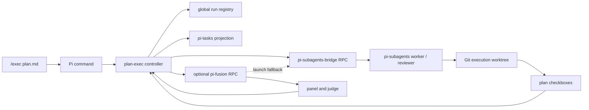

# pi-plan-exec Architecture

<!-- markdownlint-disable MD013 -->

`pi-plan-exec` is a deterministic controller around existing Pi extensions. It
owns plan-specific policy and durable transitions, not model execution, task UI,
or multi-model review.

## Design goals

- deterministic stage order and retry limits;
- one writer at a time in one execution worktree;
- fresh model context for every implementation, review, and fix operation;
- crash-safe replay without duplicate writer starts;
- cross-session recovery and adoption;
- existing Pi extensions remain the owners of their domains.

## Component ownership

| Component             | Owns                                                                                                            |
| --------------------- | --------------------------------------------------------------------------------------------------------------- |
| `pi-plan-exec`        | Plan parsing, Git safety, stages, retries, leases, recovery, prompts, findings, archival                        |
| `pi-subagents-bridge` | Versioned execution RPC, `cwd` forwarding, spawn idempotency, run observation, result normalization, stop/adopt |
| `pi-subagents`        | Fresh child sessions, built-in `worker`/`reviewer`, model execution, artifacts, lifecycle                       |
| `pi-fusion`           | Optional panel, judge, profiles, machine-readable Fusion RPC (`>=0.7.0`), validated caller output, persistent operation identity |
| `pi-tasks`            | Task file format, locking, dependencies, session widget                                                         |

The bridge and Fusion APIs are event-based, versioned RPC contracts. The
controller does not import their runtime internals. Fusion review starts request
`outputContract: "plan-review-v1"`; terminal approval uses only validated
top-level `callerOutput.output` and fails closed when it is absent. If Fusion
is unavailable before an external run is tracked, the controller uses the
pi-subagents reviewer with the same operation ID.

The exception is the pi-tasks projection adapter. Pi-tasks has no cross-extension
CRUD RPC, so `task-projection.ts` uses the shipped `TaskStore` contract. The
adapter validates the methods it needs before writing. Pi-tasks is never the
controller's authoritative state.

## Data flow


```mermaid
flowchart LR
    user["/exec plan.md"] --> command[Pi command]
    command --> controller[plan-exec controller]
    controller --> registry["global run registry"]
    controller --> projection[pi-tasks projection]
    controller --> bridge[pi-subagents-bridge RPC]
    bridge --> agents["pi-subagents worker / reviewer"]
    controller --> fusion[optional pi-fusion RPC]
    fusion --> panel[panel and judge]
    fusion -. launch fallback .-> bridge
    agents --> worktree[Git execution worktree]
    panel --> controller
    worktree --> plan[plan checkboxes]
    plan --> controller
```

The controller re-reads the plan after implementation. A child saying “done” is
not completion evidence; checked plan items are.

## Source modules

| Module                   | Responsibility                                                                    |
| ------------------------ | --------------------------------------------------------------------------------- |
| `src/index.ts`           | `/exec` command surface, interactive selection, background controller loop        |
| `src/controller.ts`      | State transitions, operation launch/observation, retries, cancellation, recovery  |
| `src/types.ts`           | Run, stage, operation, finding, and frozen configuration contracts                |
| `src/registry.ts`        | Locked atomic run persistence, migration, leases, liveness, removal               |
| `src/lifecycle.ts`       | Stage order and status classification predicates shared by command and controller |
| `src/plan.ts`            | Strict Markdown plan parser and structure hash                                    |
| `src/git.ts`             | Repository, branch, dirty-state, common-dir, and worktree safety                  |
| `src/bridge.ts`          | Typed client for `plan-exec:bridge:v1`                                            |
| `src/fusion.ts`          | Typed client for `fusion:rpc:v1`                                                  |
| `src/task-projection.ts` | Session pi-tasks projection and rebuild                                           |
| `src/artifact.ts`        | Subagent output/result fallback extraction                                        |
| `src/review.ts`          | Structured finding parsing and severity decisions                                 |
| `src/progress.ts`        | `.ralphex/progress/` execution log                                                |

## Authoritative state

Run records live at:

```text
~/.pi/plan-exec/runs/<run-id>/run.json
```

Writes use compare-and-set updates under tokenized lock files plus temporary-file
rename. Controller transitions use a per-run lock; stale reload instances cannot
blindly overwrite newer pause, cancellation, or operation state. Each record
includes:

- repository, worktree, branch, and plan structure hash;
- status and current stage;
- task and stage attempt counters;
- active operation ID, external run ID, parameters, and result location;
- review and unresolved findings;
- pending and completed force-skip audit records;
- explicit execution-branch rebindings;
- frozen role/model limits;
- session lease with pid, hostname, and heartbeat;
- the last worker signal digest parsed from the provider status text;
- retirement and reconciliation stamps.

`lease.hostname`, `retiredAt`, `reconciledAt`, and `activeOperation.workerSignal`
are all optional. `schemaVersion` stays at `1`: records written before those
fields existed still parse, and `assertRun` validates none of them.

### Lease liveness

A stored lease is a claim, not evidence. `isLeaseLive` treats a lease as live
when the calling session owns it; otherwise a heartbeat older than 30 seconds is
dead, and a fresh heartbeat is live unless the lease names this host, in which
case the recorded pid must still be running. A lease naming a different host, or
no host at all — the shape of every record written before the field existed — has
no pid this machine can check, so its fresh heartbeat is the only evidence
available and it counts as live.

`claim` stamps the host once and `heartbeat` never re-stamps it, so the name is
frozen for the run's whole life while `os.hostname()` moves with the network.
The whole name identifies the machine, case-folded: `foo.local` and `foo.lan`
are as foreign to each other as `foo` and `bar`. Only the first label would be
cheaper, but corporate DNS gives `build.a.example` and `build.b.example` the
same one, and a registry on a shared or NFS home shows both machines' runs — so
that reduction reads a live remote worker as a dead local one and resets the run
under it. A name that is not exactly this one is treated as another machine, and
the renamed machine that reduction was meant to help is recovered by the
operator instead, with `--same-machine` below.

A session may claim a run when no lease exists, the lease belongs to that
session, or the prior lease is not live by that rule. A dead local pid therefore
frees the run at once instead of after the heartbeat window. The lease controls
cross-session ownership; compare-and-set updates and the per-run controller lock
serialize same-session reload instances.

Claiming is not the only consumer: the same predicate answers whether a run is
safe to remove, and it is one third of the abandonment conjunction, so ownership,
cleanup, and diagnosis cannot disagree about who holds a run.

### Retirement and cleanup

Terminal state is retired, not accumulated, in three steps:

1. A successful `archive` stage stamps `retiredAt`.
2. `/exec status` hides terminal runs 24 hours after their last update, counting
   the hidden rows in a footer that names `--all` and `/exec cleanup`. The listing
   filter keys on terminal status plus `updatedAt`: a just-archived run is news for
   a day whatever its stamp says.
3. `RunRegistry.remove` deletes the run directory. `removalRefusal` gates it on
   the same two facts the `/exec cleanup` preview shows, so the preview can never
   promise a removal the registry would reject: a non-terminal run is refused, and
   so is a run held by a live lease. Both are decided under the run's own lock,
   with the record read inside it — deciding first and locking afterwards would let
   a concurrent claim revive the run into the window before the delete. The
   controller lock is taken first, in the order every controller takes it: a
   `/exec resume` holds it from before its claim until the recovery ends, and a
   removal that ignored it would delete the record mid-recovery. A removal that
   cannot take it refuses rather than waits.
   `/exec cleanup` selects `completed`, `completed_with_findings`, and `cancelled`
   runs that finished more than 7 days ago, measured from `retiredAt` where the
   record carries one and from `updatedAt` otherwise, so a lease release does not
   restart the clock; `failed` is excluded unless `--include-failed` is passed,
   because the registry entry is what `/exec resume` needs. Naming one full run ID
   bypasses the retention window and the exclusion, never the refusal. Each removal
   is reported separately: one refusal cannot hide the deletions around it.

Removal deletes the registry entry only. Worktrees, branches, and
`.ralphex/progress/` logs are never touched, so a deleted record costs the ability
to resume or inspect that run and nothing else. A `run.json` the registry cannot
parse is removable too: `list` drops it, so removal is the only action that
applies. Only a parse failure counts as corrupt — an I/O or permission error is
rethrown rather than answered with a recursive delete.

### Abandonment

A run is `abandoned` only on the full conjunction: an in-flight status, a lease
that is not live, and a tracked operation provably gone — its async directory
absent from disk, or the bridge answering `absent` for its operation ID. Anything
short of that is `ambiguous`: it is reported and never reset, because resetting a
run whose worker is alive can put a second writer in one worktree, which is worse
than the stall. Reconciliation clears the operation, records a `failed` status
naming the evidence, stamps `reconciledAt`, appends the reason to the progress
log, and leaves `taskAttempts` untouched — the worker never ran. Recovery is then
the ordinary `/exec resume` path.

One function maps a run and its evidence to a verdict and exactly one next
command. The sweep row, the settled row, the detail view, and the refusal the
resume gate raises all render that one result, so no two of them can name
different commands for the same record. The command is always one the sentence
beside it names first, and always one the run will accept. `/exec status` is
named only where the next read can differ — something is polling, or an
operation is left to probe. Where nothing polls, the command has to move the
run: a takeover for a dead owner, `/exec stop` for a worker that cannot be
proven gone, `/exec stop` again for a stop nothing will land, and the waiver
again for a pending waiver nothing will finish. Naming a re-read there would
loop the reader on a record nothing updates.

Every evidence-driven decision reads the same three inputs at the moment it is
made: the lease, the operation directory on disk, and the bridge. Nothing about
liveness is persisted, because the record is only refreshed while its owning
session polls — the instant that stops being true is the instant the question
matters. Evidence measured here is also discarded for a run whose lease names
another host: its directory and its bridge are on that machine, and an absence
observed locally would be an absence of the wrong thing. Any rename at all is
indistinguishable from a genuinely foreign host, so nothing observable can
settle such a run and it would stay `ambiguous` forever. The
operator breaks that tie: `/exec resume <id> --same-machine` asserts that the
frozen name was this machine, unblocks the local checks, and changes nothing
else — the abandonment conjunction still decides, so a worker still writing here
keeps the run `ambiguous` and resume still refuses. Only the probe reads the
asserted host; lease liveness keeps reading the stored lease, so a beating
heartbeat still reads `live` whichever machine stamped it. The assertion is
never written back; the reset's own `claim` re-stamps the current host. It is
refused on a run this machine can already observe, refused while the lease is
still beating, and `/exec doctor --reconcile` has no equivalent: a
registry-wide host assertion would speak for every run at once.

One writer performs every reset, so both callers inherit its exclusions.
A `cancel_pending` run is never reset however dead its worker: `failed` would
erase the stop the operator asked for, and the next resume would restart plan
work instead of finishing the cancellation. `/exec resume <id>` reconciles the
single run it recovers; the registry-wide sweep behind `/exec doctor
--reconcile` is dispatched as a write command and is unreachable from any read.

## Crash safety

External starts follow this order:

1. Generate a durable operation ID.
2. Persist operation intent and replay parameters.
3. Call Bridge or Fusion with that operation ID.
4. Persist the returned external run ID.

If Pi stops between steps 2 and 4, or a start reply times out or is malformed,
recovery reconciles the same operation ID. Bridge `0.2.2` or later reports an
operation as `found`, `pending`, `unknown`, or `absent` and advertises compatible
workflowScript spawning; the controller only
attaches `found` work and refuses a blind replay for every other uncertain
outcome. Fusion retries its persisted operation ID; an unavailable Fusion
launch falls back to pi-subagents with that same operation ID. Active
foreign-session runs are observed rather than replaced.

## Stage pipeline

The controller uses these stages:

1. `resolve`
2. `project_tasks`
3. `branch`
4. `progress`
5. `implementation`
6. `comprehensive_review`
7. `smells_review`
8. `fusion_review`
9. `critical_review`
10. `finalize`
11. `stats`
12. `archive`
13. `complete`

Isolation is selected before the durable run is created. `isolation` remains in
the schema for migration and explicit transition handling.

Implementation repeatedly selects the first task with unchecked boxes and runs
one worker. Comprehensive and Fusion review can loop through findings and a sole
fixer. The Fusion review uses pi-subagents when the optional Fusion provider is
unavailable. Smells and critical review are single-pass review/fix stages. Known
findings that survive caps are retained and produce `completed_with_findings`.

## Cancellation, pause, and force-skip

`/exec stop` is the reader-facing verb. It offers only the outcomes the run can
still take, asks even when one remains, and refuses without a UI; the two
outcomes below are also the non-interactive entry points.

- `pause` allows the active external operation to finish, then removes it without
  advancing the stage.
- `cancel` requests Bridge/Fusion stop when possible, keeps polling through
  `cancel_pending`, retries provider errors without discarding operation state,
  and ends at `cancelled` only after the operation is terminal.
- Both preserve the execution worktree.
- A branch rebind verifies the same repository, requires no active operation, and
  is recorded explicitly before resuming. Interactive `resume` asks for it when
  the run's error is an execution-branch mismatch and nothing is tracked;
  `--adopt-current-branch` answers the same question for a caller with no human.
- `skip` is an interactive, auditable waiver for review, finalization, and
  statistics only. It first persists `skip_pending`, then stops and terminally
  reconciles any tracked operation before clearing it and advancing exactly one
  stage. Skipped stages retain current findings as unresolved and cause
  `completed_with_findings`; implementation and archive are not skippable.

The background loop serializes ticks per run. It temporarily hides active tools
from the main agent so projected pi-tasks rows are not interpreted as a second
execution queue.

## Trust boundaries

Untrusted boundaries are validated at entry:

- Markdown plans use strict headings, numbering, and checkbox rules.
- Registry run IDs must be UUID-shaped before path construction.
- Stored run records are schema-checked and migrated.
- Bridge/Fusion replies are parsed from `unknown`.
- Fusion review requires validated top-level `callerOutput` for
  `plan-review-v1`; `run.report` is not an approval fallback.
- Reviewer output must be `NO_FINDINGS` or structured findings.
- Git common-directory and branch checks protect writer stages.
- `src/types.ts` owns persisted run/status/stage/operation constants. ESLint
  rejects raw domain values in control-flow comparisons and non-trivial magic
  numbers in runtime source, keeping state-machine changes reviewable.

## Further design record

The implementation originated from the detailed design in
[`plans/2026-07-12-pi-plan-exec-design.md`](plans/2026-07-12-pi-plan-exec-design.md).
That document records the design discussion and broader intended behavior. This
file describes the current module boundaries and runtime contracts.
