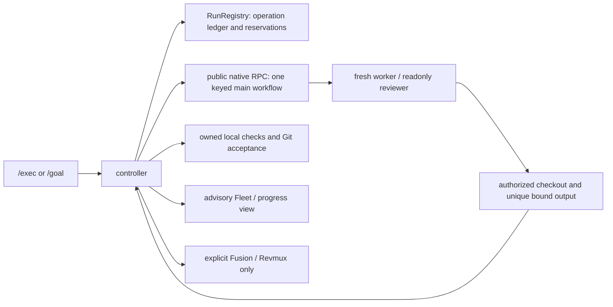

# pi-plan-exec Architecture

`PlanExecController` owns domain policy, not a second workflow engine. It keeps
one writer per execution target, fresh model context per operation, deterministic
task eligibility, accepted/reviewed commits and deliberate recovery. New work
uses unmodified pi-subagents 0.76.1 through public native RPC. See
[runtime contracts](runtime-contracts.md) for evidence and safe limitations.

## Boundaries

| Module | Owned responsibility |
| --- | --- |
| `src/index.ts` | `/exec` and `/goal`, session lifecycle, one polling loop, readonly view, parent-only activation |
| `src/controller.ts` | Task/goal stages, operation preparation/observation, checks, review, acceptance, retry, stop and archive |
| `src/registry.ts` | Authoritative run ledger, CAS, leases, reservations, stable locks, fsynced abandonment backup/archive |
| `src/registry-lock.ts` | OS `flock` locks at stable never-unlinked paths |
| `src/native-runtime.ts` | Public RPC correlation, immutable request dispatch, exact observation/control, native result binding |
| `src/operation-safety.ts` | Native request digest, metadata validation, distinct dispatch and late-binding predicates |
| `src/execution-contract.ts` | Pure lifetime, request digest and published retirement-proof validation |
| `src/legacy-operation.ts` | Bounded lazy read-only schema-7 snapshot lookup and imported-evidence validation |
| `src/native-reviewer.ts` | Namespaced readonly role registration through public runtime-agent events |
| `src/artifact.ts`, `src/review.ts` | Explicit native result contracts, commit-bound typed review; separate legacy decoding |
| `src/task-summary.ts` | Pure summaries derived from `run.tasks`, no external task store |
| `src/runtime-integration.ts`, `src/run-view.ts` | Advisory Fleet/background-work and session-local presentation |
| `src/plan.ts`, `src/scheduler.ts` | Markdown/task identity, approved plan structure, dependencies and wake selection |
| `src/goal-loop.ts` | Goal marker protocol, committed check evidence, stall/iteration policy |
| `src/lanes.ts`, `src/git.ts`, `src/isolation.ts` | Frozen commands, worktree identity, selective checkpoints, lanes and quarantine |
| `src/local-operation.ts`, `src/owned-process.ts` | Local command intent, process-group ownership, cancellation and retirement |
| `src/fusion.ts`, `src/review-backend.ts` | Explicit alternative backends with independent capability refusals |
| `src/progress.ts` | Applied-transition-only progress history |

There is no Bridge client/RPC server, new launch journal or pi-tasks adapter.
The production package imports no private native runtime modules. Fixture-only
runtime seams are pinned and distinguished from the packed normal-loader gate.

```mermaid
flowchart LR
    commands["/exec or /goal"] --> controller
    controller --> registry["RunRegistry: operation ledger and reservations"]
    controller --> native["public native RPC: one keyed main workflow"]
    native --> child["fresh worker / readonly reviewer"]
    child --> files["authorized checkout and unique bound output"]
    files --> controller
    controller --> checks["owned local checks and Git acceptance"]
    controller --> views["advisory Fleet / progress view"]
    controller --> alternatives["explicit Fusion / Revmux only"]
```

## Durable operation protocol

Records live at `~/.pi/plan-exec/runs/<run-id>/run.json`. Registry-wide,
controller and record locks have stable paths. CAS writes use atomic rename and
monotonic revisions; unrelated metadata must not erase stop intent or reset a
terminal retention anchor. Controller-to-record lock ordering is preserved.
Never hold the record lock across provider RPC.

Preparation freezes logical operation/kind/task/review/candidate, cwd, request,
RPC UUID, controller session UUID, native runtime identity, output path and
requested limits. Input cwd must canonically match the current authorized
`run.worktreeCwd`, including nested/task lanes. Dispatch revalidates it against
fresh authority rather than permitting any absolute override.

`prepared -> dispatching -> bound -> retired`: dispatch CAS precedes emission.
Only an intact prepared record or exact retirement permits another authorized
attempt. Unknown dispatch never emits another spawn. Targeted status uses
`rpc-spawn-<uuid>` and verifies both `workflowChildren.parentToolCallId` and its
root ID. Completion events can retain a fast binding but cannot replace proof.
Facts for the same active/failed operation are synchronized, so an older failed
snapshot cannot resurrect an already-retired attempt after lost-reply recovery.

The awaited `main` normally runs detached. Its recorded `async:true` requires
one exact child proof in the published closed workflow roster. Recorded
synchronous mode is handled explicitly; empty arrays alone are not retirement.
A failed no-child workflow cannot provide task success. Missing/expired
correlation stays fenced with a useful diagnosis, not a guessed identity.

Status/doctor use `NativeRuntimeClient.inspect`, sharing validation without any
registry writes or native control. Exact binding is identity, not retirement;
unknown/absent/refused observations stay inconclusive. Explicit reconciliation
uses the scanned revision under CAS, so inspection cannot authorize a stale
release or replay.

## Domain acceptance stays controller-owned

The plan parser freezes task structure separately from checkbox completion.
Omitted `dependsOn` preserves sequential order; `dependsOn: []` makes a task
independent. The scheduler never treats unchecked prerequisites as accepted.
A failed partial task retains its lane; independent work can start in a clean
lane at the accepted baseline, excluding unaccepted and ignored user content.
When the baseline advances, recovery creates a fresh lane with a selective
checkpoint rather than revalidating an old candidate against a new baseline.

A task is accepted only after a successful exact child, committed checked plan
items, accepted/checkpoint ancestry, frozen required checks and a clean tree.
An output marker is not Git evidence. Bound `TASK_FAILED` diagnostics can record
an observed external prerequisite and schedule bounded backoff; generic prose
cannot infer credentials or permission failure. Failed-child output is diagnostic
only. Local commands retain durable authorization and owned-process retirement.

`/goal` uses the same controller without a task DAG or plan file. A goal marker
requires a successful turn, committed work and the frozen checks; failed turns
cannot pass by printing `GOAL_DONE`. Only implementation turns consume the goal
iteration budget. Test deletion/weakening and uncommitted changes remain final
acceptance blockers. Review/fix and final verification use the same gates.

Required review is one readonly `plan-exec-reviewer` by default, with no implicit
backend fallback. Configured frozen agents/models are honored. The typed report
binds the exact candidate commit; all findings require severity, summary,
evidence and suggestion. The controller verifies HEAD again before accepting
review. Schema failure, missing output and wrong commits never become a clean
review. Optional statistics cannot waive mandatory checks or review.

New artifacts are unique under the owning run. Validated result/proof copies
are written via the existing authorized record-lock seam before acceptance.
Structured requests omit file-only mode to avoid 0.76.1's premature required-file
guard on structured-output-only completion; the runtime still persists the exact
bound JSON. Marker operations keep file-only mode. The specific successful
sole-child `settled-awaiting-resume` receipt can be consumed after wrapper
failure; missing or inconsistent evidence is fenced, not a fresh worker launch.

After all tasks, review and checks succeed, `outputTarget` guards promotion back
to the original branch: known accepted ancestor, clean target and no ignored or
preserved file overwrite. Promotion and plan archival are durable local
operations. Progress is logged only after the matching state transition applies.

## Stop, sessions and retention

Stop intent and delivery are separate from retirement. Pause is resumable;
ordinary stop is final cancellation. Cancellation can bind a late identity but
cannot consume a result, advance review or erase a newer stop generation.
Provider refusal or timeout retries the same operation, never another worker.

Force-stop durably backs up, abandons and revokes ordinary mutation before
best-effort native stop. It ends management even if ownership remains unknown.
No polling, session reload, result callback or UI preference may revive it.
Only exact retirement through the registry's narrow abandoned-operation path
can release reservations. Final archive fsync and controller-lock quiescence
precede registry cleanup; workspace and provider storage are not deleted.

A native early stop may leave `writer-close-unverified`. That target remains
reserved. Neither stopped text nor runner PID disappearance is a substitute
proof. Local process groups similarly retain their documented escaped-descendant
limits rather than inventing stronger containment.

Lease UUID/host/pid, display owner attribution and native session file identity
are different concepts. A lease takeover never grants another native session's
control authority. A foreign-host lease requires explicit same-machine handling
or recovery on its host. The native runner's `PI_SUBAGENT_CHILD=1` makes the
extension inert before registration or registry access, while leaving unrelated
ambient extensions available for provider/MCP functionality.

## Read-only legacy recovery

Known historical native IDs can be observed without a journal. An unbound record
requires explicit `resume --legacy-journal /absolute/path/to/offline.sqlite`.
The snapshot must be schema 7 and SQLite-consistent; the importer checks original
run/operation/digest and fresh CAS, retaining binding/rejection/cancel evidence
without rewriting original intent. Absence, a receipt or a mapping is not
non-start/retirement/replay authority. No default live journal is opened, migrated
or reset. Abandoned records cannot import or resume.

Native isolated recovery can fence its old registry generation and preserve the
quarantined original target while preparing a separate checkout. Read-only legacy
import cannot revoke a historical dispatch service, so unresolved legacy
isolation refuses before filesystem mutation. Unknown active, failed and
quarantined identities continue reserving their targets.

## Validation

Source-named tests preserve domain, CAS, generations, leases, force-stop and
retention behavior. `test:runtime-smoke` exercises real detached native execution;
`test:native-recovery` checks correlation across new OS hosts and preserves the
negative direct-leaf case. `test:packed-consumer` installs a real tarball with
neither removed package present and uses normal ambient loading plus a localhost
scripted model. It proves default reviewer registration, typed clean/findings and
rejection, lost replies, stop/restart, child inertness and no lease takeover.
These are runtime/control guarantees, not claims about live model reliability.
