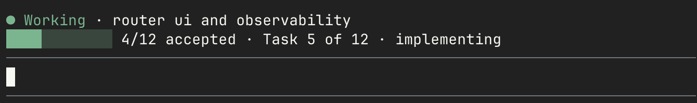
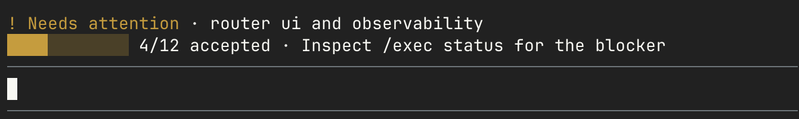
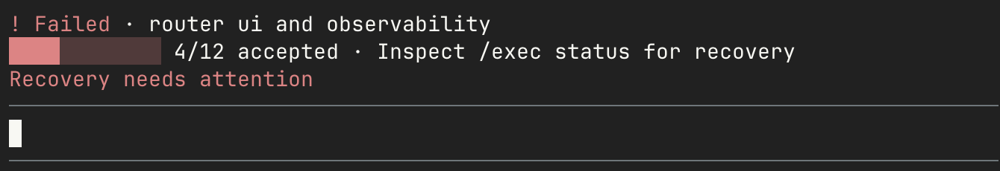
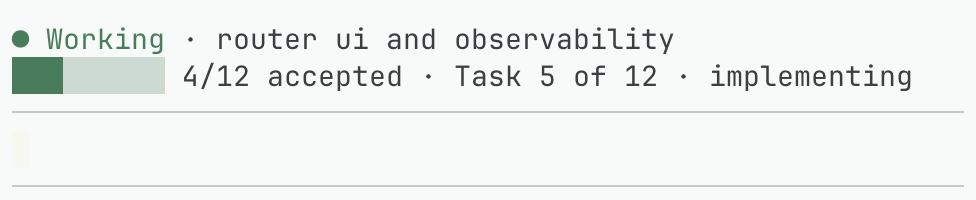

# Progress strip and live Pi validation

The selected UI is the progress strip. It uses Pi's own theme colors and terminal
components. It does not embed a browser or replace the footer.

## Screenshots

These are cropped screenshots of Pi 1.0.4 running in agterm, not HTML prototypes.
The displayed twelve-task states are deterministic visual fixtures from the
initial live UI check, not evidence that those fixture workers were running.
A separate real worker/recovery fixture verifies execution. Cropping removes local paths and
unrelated application content.

### Healthy work — green

### Waiting or uncertain — amber

### Failure — red

### Narrow light-theme view

Color is never the only signal: state text and symbols remain readable without it.
Twelve accepted implementation tasks can still mean review/checking, not complete.

## Controls

| Command | Effect | Changes execution? |
| --- | --- | --- |
| `/exec hide` | Remove strip and footer immediately | No |
| `/exec show [run-id]` | Restore display, optionally pin one run | No |
| `/exec clear [run-id]` | Dismiss one displayed run | No |
| `/exec status [run-id]` | Read diagnostics, paths and evidence | No |
| `/exec pause [run-id]` | Pause resumably | Yes |
| `/exec stop [run-id]` | Final cancellation without a dialog | Yes |
| `/exec stop <run-id> --force` | End management permanently; retain unresolved ownership | Yes |
| `/exec ui on\|off` | Toggle the display without changing execution | No |
| `/exec cleanup --apply` | Remove eligible terminal registry records | No worker control; deletes evidence |

Hide/clear need no `--apply`. Preferences follow the active session branch and
survive reload. A new independent session has its own preferences.
Cancellation means intent first, delivery second, confirmed retirement last.
A user can hide any intermediate state.

## Reproduce safely

Use [Development's recovery fixture](../DEVELOPMENT.md#visible-recovery-integration).
It creates fresh repositories and an isolated home/journal. Its local HTTP model
is scripted; Pi, Bridge, subagents, controller, Git and terminal rendering are real.
Never run these fixtures against a real run registry.

For unpolled display fixtures, additionally load `test/fixtures/progress-ui.ts`
in that same isolated host. Run `/fixture-strip running|waiting|failed|paused|cancelling|complete`
and then `/exec show <fixture-run-id>`. Each display-only run has a foreign
fixture lease, so the controller cannot dispatch a worker from it. With the
snapshot guard, its in-flight states now render amber Snapshot. Capture live
progress colors from an actually polled isolated worker, not by changing that
fixture lease to pretend ownership.
`/fixture-theme light|dark` changes only the fixture host theme.

agterm command input can accept an autocomplete item on the first Return.
Read the target session's editor before sending the next command; if the full
command remains in the editor, Return submits it. Never type into an unverified
session or approve another user's dialog.

## Display checks

Live checks covered hide/show, hide across reload, clearing one run while another
remains visible, and restoring the selected run. The window was resized from
78 to 56 columns and the Pi theme changed without a render crash. Unit tests also
cover widths down to one column, CJK/emoji, terminal escapes and bidi controls.
The status examples use the dark theme. The narrow example uses Pi's light
palette on a light terminal background. Theme changes invalidate and recolor
existing widgets without waiting for a controller tick.

## Snapshot ownership checks

Regression tests cover same-host/other-session, other-host and unleased snapshots,
startup and explicit show, externally changed saved state, paused cleanup,
settled completion, and local poll failure/recovery. Unpolled views cannot turn
green just because the saved run says running. Pure rendering also defaults to
snapshot mode unless the caller supplies live-observation context.

## Execution evidence

The live rejection-recovery fixture accepted one task and completed with native
workflow retirement proof. It recorded exactly two spawn requests: one rejected
before launch and one successful worker. The synthetic legacy unbound operation
remained blocked; no replacement worker was started.

The legacy fixture was then cancelled and its disposable checkout removed.
The durable state stayed `cancel_pending`, stop intent remained set, no delivery
receipt was invented, the checkout remained absent, and dispatch count stayed two.
The real user's unresolved router run was not changed.

The initial UI implementation gate passed 557 Vitest tests and 117 node:test
lifecycle/command tests, followed by
2 released-runtime smoke tests, Biome/types and the package allowlist. A clean
packed consumer loaded `/exec` and `/goal` with the released native peers and
no host-module warning. Documentation links passed.

This validates the control path, not arbitrary external services or a live model's
judgment. Native pi-subagents 0.76.1 still refuses some paused/queued RPC stops.
See [upstream limits](upstream-audit.md).
